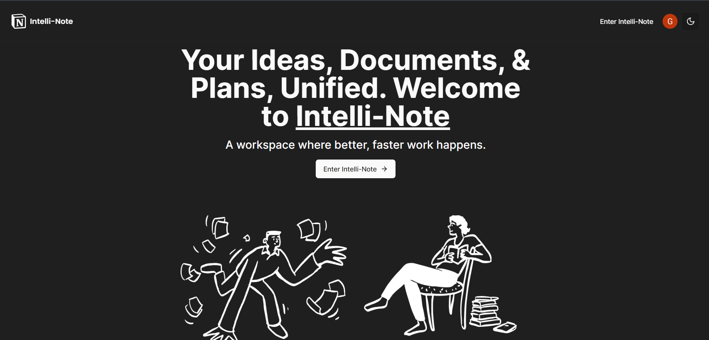
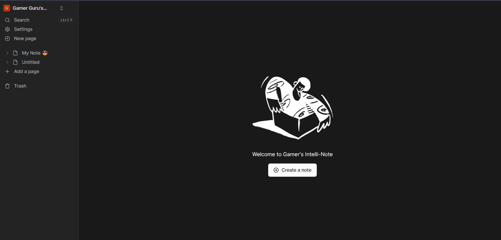
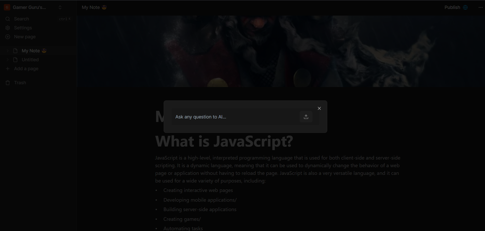
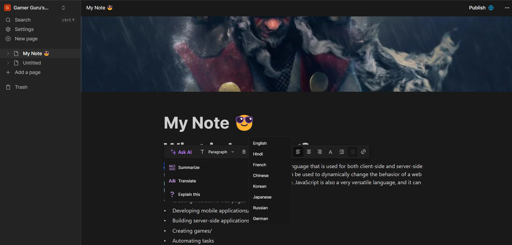

## Intelli-Note: A workspace where better, faster work happens.

## Getting Started

Write your important notes, docs easily with the 💪 of AI.



## Create note ✨

Create your first note easily by clicking on the 'create a note' button on the dashboard or using sidebar 'New page' button.



## Ask your question 🤔 to AI

Press 'ctrl+/', which opens a modal where you can ask all of your questions.



## Advanced AI features

Select a text you want your AI assistant to answer. You can summarize, translate into other languages, and even further explain the selected text.



## Installation

First, run the development server:

```bash
npm run dev
# or
yarn dev
# or
pnpm dev
```

Open [http://localhost:3000](http://localhost:3000) with your browser to see the result.

You can start editing the page by modifying `app/page.tsx`. The page auto-updates as you edit the file.
